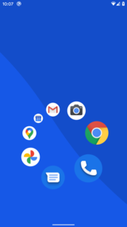
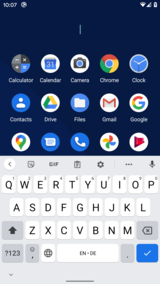

# Pie Launcher

Android home screen launcher that uses a dynamic
[pie menu](https://en.wikipedia.org/wiki/Pie_menu)
instead of tables of icons.

Once you get used to it, you can launch your most frequently used apps
using [muscle memory](https://en.wikipedia.org/wiki/Muscle_memory) without
even looking at the screen.

Apps you don't use regularly are quickly available with just one tap and
by typing the first one or two letters of the app name.

If you find this app useful and wish to support its continued development,
you can [buy me a coffee](https://www.buymeacoffee.com/markusfisch) or
send some Bitcoin decimals to `bc1q2guk2rpll587aymrfadkdtpq32448x5khk5j8z`.

&nbsp;&nbsp;

## Video

## Screenshots

## Get it

 

## Guide

### How to use the pie menu

Tap and hold to open the pie menu. Then swipe to choose an app to start.

### How to open the app list

Tap once to open the list. Then type the name of an app you want to start.
Usually, one or two letters are enough, even if you mistyped a letter.
If the app in the top left is the one you want, you can hit the Search
key on your keyboard to start it.

### How to close the app list quickly

Swipe down to close the app list.

### How to edit the pie menu

Long press an app in the listing of apps to enter the editor for the pie menu.
Use 4, 6, or 8 icons in the pie menu to make the most out of it.

## Troubleshooting

### There's a short delay after doing the home gesture

This is an Android bug that Google needs to fix.
All 3rd party launchers suffer from this bug. See:

* [Homescreen interaction delay with gesture navigation?](https://www.reddit.com/r/GooglePixel/comments/dp5x1i/homescreen_interaction_delay_with_gesture/)
* [What is up with home gesture animations with 3rd party launchers.](https://www.reddit.com/r/GooglePixel/comments/ecvbiv/what_is_up_with_home_gesture_animations_with_3rd/)
* [Nova Launcher Tweet](https://twitter.com/Nova_Launcher/status/1169295641538940930)

A possible workaround is to **use the back gesture** instead of the home
gesture wherever possible (this may not be desirable in a browser app,
as it also closes the open tab).

The back gesture works immediately and without any delay.

### The soft keyboard takes too long to appear

This is an issue of your keyboard app that may do too much work.
Unfortunately, GBoard is not the best choice for all devices.

I recommend using a lighter alternative like
[OpenBoard](https://f-droid.org/de/packages/org.dslul.openboard.inputmethod.latin/)
which is fast even on low-end devices.

### Home returns to the default launcher

Please set Pie Launcher as your default home screen launcher.

You can either do this manually from your phone's Settings → Apps → Default
apps. Or from the settings within Pie Launcher (enter the editor and tap on
the settings icon) where there should be an item "Make default launcher".
