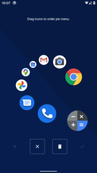

# Pie Launcher

Android home screen launcher using a dynamic pie menu instead of fixed icons.

Swipe to open the pie menu and choose an app to start.
Or just tap and type the name of an app you don't use regularly.

Long press an app in the listing of apps to enter the editor for the pie menu.
Use just 4, 6 or 8 icons in the pie menu to make the most out of it.

As soon as you're used to it, you can open your most used apps with muscle
memory anywhere on the screen without even looking at it.

## Screenshots

## Download

